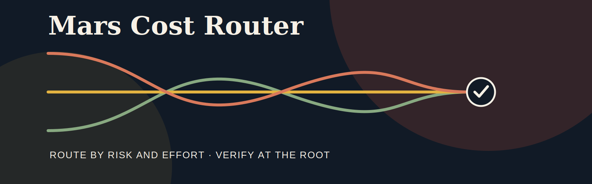
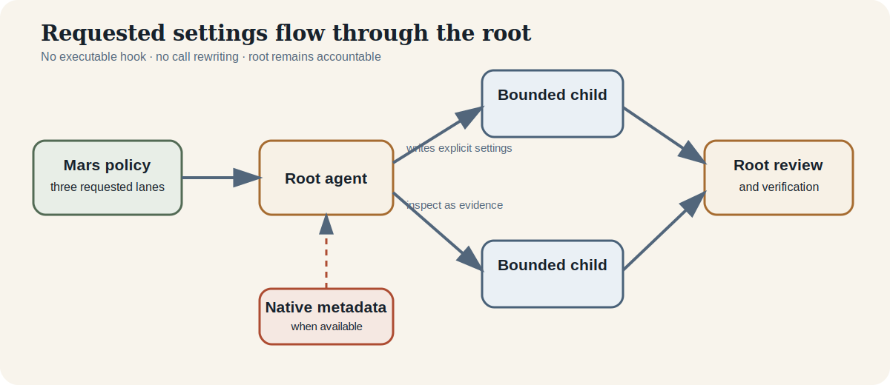
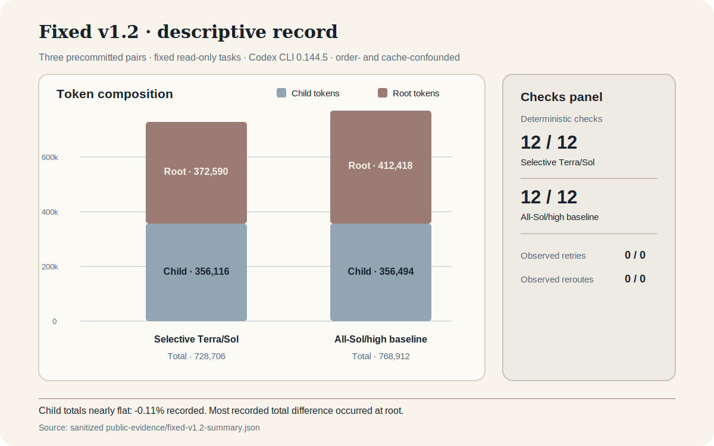
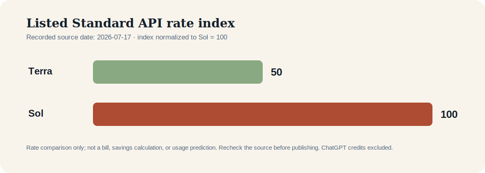

# Mars Cost Router



> **An independent, instruction-driven delegation policy for Codex.**
> Route by risk and effort; verify at the root.

> **Unofficial:** Mars Cost Router is not affiliated with or endorsed by OpenAI. “Mars” is this project's brand, not a model.

[](https://github.com/userbox020/mars-cost-router/actions/workflows/validate.yml)    

Mars Cost Router is a small local plugin with a three-lane policy for bounded subagent delegation. It gives the root explicit requested settings, supports bounded self-contained child messages, and keeps integration and verification with the root. The instruction-only policy makes route intent reviewable while the root evaluates returned work and, when available, native runtime metadata.

Project: [userbox020/mars-cost-router](https://github.com/userbox020/mars-cost-router)

**Build Week judges:** [Read the Project Story and verification path](PROJECT_STORY.md).

## Quickstart

```sh
codex plugin marketplace add userbox020/mars-cost-router
codex plugin add mars-cost-router@mars-plugins
```

Start a **new Codex session**, open the plugin browser or `@` surface, and select Mars Cost Router. In surfaces that expose Codex skills, `$mars-cost-router` is the skill syntax. Surface availability can vary by Codex version and interface.

Use the concise [Playbooks](docs/PLAYBOOKS.md) for adaptable workflows, and see
[Install and troubleshooting](docs/INSTALL.md) for setup, refresh, discovery,
availability, and permission guidance.

## A reviewable delegation toolkit

| Strength | How it supports a clear handoff |
| --- | --- |
| **Decision-first lane policy** | Root/no-delegation comes first; Premium risk takes precedence, Economy requires every low-risk condition, and Balanced is the delegated default. |
| **Bounded handoffs** | Self-contained messages define one objective, scope, acceptance criteria, and an optional reviewable return shape. |
| **Cause-aware recovery** | The root distinguishes weak or conflicting evidence, malformed calls, missing authority, unavailable models, and increased risk without silent substitution. |
| **Owned decomposition** | The guidance avoids overlapping parallel writer scopes, waits for reviewed prerequisites, and keeps final integration at the root. |
| **Root acceptance** | The root inspects returned evidence, resolves conflicts, and runs final verification before making final claims. |
| **Practical playbooks** | Four adaptable workflows cover bounded lookup, focused implementation, security review, and dependent work. |
| **Inspectable, privacy-conscious package** | A compact skill and versioned policy use generic labels and minimum-necessary context without adding a runtime. |
| **Verified release path** | Local installation guidance, package validation, and hosted CI provide a direct path to inspect the release. |

## Three deliberate lanes

| Lane | Good fit | Requested model and effort | Context |
| --- | --- | --- | --- |
| **Economy** | bounded inspection, lookup, low-risk checks | `gpt-5.6-terra` · `low` | `fork_turns: "none"` |
| **Balanced** | focused implementation, tests, documentation, review | `gpt-5.6-terra` · `medium` | `fork_turns: "none"` |
| **Premium** | security boundaries, difficult debugging, broad uncertainty | `gpt-5.6-sol` · `high` | `fork_turns: "none"` |

Terra is the lower-listed-rate lane under the dated Standard API rate source.
Lane choice follows the decision protocol above; recovery remains a reviewed
root decision rather than an automatic retry or substitution.

## How it fits

<p align="center">
  
</p>

The skill and versioned policy give the root a clear request shape. The root writes the child request, receives the result, and owns final verification. Native child metadata, when available, gives the root runtime detail to inspect alongside the returned work.

### Sanitized child request shape

```json
{
  "task_name": "focused_check",
  "message": "Inspect one bounded area. Return findings only. Do not delegate or spawn another agent.",
  "model": "gpt-5.6-terra",
  "reasoning_effort": "medium",
  "fork_turns": "none"
}
```

Use `task_name` as a short, generic, privacy-safe label. Put the bounded objective, scope, permissions, acceptance criteria, and return format in `message`; this keeps each handoff clear for the child and reviewable by the root.

## Watch the 0.3.1 walkthrough

[Watch the 0.3.1 walkthrough](https://github.com/userbox020/mars-cost-router/releases/download/0.3.1/mars-cost-router-explainer-0.3.1.mp4) · [Script](demo/VIDEO_SCRIPT.md) · [Captions](demo/CAPTIONS.vtt) · [Recording checklist](demo/RECORDING_CHECKLIST.md) · [Terminal commands](demo/TERMINAL_COMMANDS.md)

The video highlights explicit lanes, bounded requests, inspectable instruction-only architecture, sanitized presentation, verified installation/CI, and the fixed-series record. See Evidence for scope and methodology.

## Fixed v1.2 descriptive evidence

<p align="center">
  
</p>

Three precommitted pairs of four fixed read-only tasks recorded against Codex CLI 0.144.5:

| Recorded observation | Selective Terra/Sol policy | All-Sol/high baseline |
| --- | ---: | ---: |
| Deterministic checks | 12 / 12 | 12 / 12 |
| Observed automatic retries | 0 | 0 |
| Observed reroutes | 0 | 0 |
| Child tokens | 356,116 | 356,494 |
| Root tokens | 372,590 | 412,418 |
| Total tokens | 728,706 | 768,912 |
| Median wall duration | 45.094 s | 53.328 s |

Both arms recorded **12 / 12** deterministic checks, with zero observed automatic retries and reroutes. Child-token totals were nearly flat: **356,116** versus **356,494** (**-0.11% recorded**). Most of the recorded total-token difference occurred at the root; total tokens were **728,706** versus **768,912** (**-5.23% recorded**). [Evidence](docs/EVIDENCE.md) contains the fixed-series scope, methodology, and claim boundaries.

Mars’s published comparison normalizes dated Standard API listed rates as of **2026-07-17** to Terra **50** and Sol **100**. [Evidence](docs/EVIDENCE.md) covers the source, method, recheck guidance, and the distinction from ChatGPT credits.

<p align="center">
  
</p>

The sanitized machine-readable [fixed-v1.2 summary](public-evidence/fixed-v1.2-summary.json) and [rate index](public-evidence/rate-index-2026-07-17.json) provide the compact public record. [Evidence](docs/EVIDENCE.md) links the definitions, provenance, boundaries, and Heldout-v2 context.

## Reviewable boundaries

- Treat lane fields as instruction-driven **requested settings**, with the root checking each pending handoff before it starts.
- Inspect native child metadata when available to distinguish requested settings from observed runtime detail.
- Confirm model availability for the account, CLI, and environment before relying on a lane.
- Use static validation for package conformance and runtime evidence for runtime observations.

## Security and privacy by design

The minimal, inspectable package centers on an instruction skill and versioned policy. Use generic labels, bounded child messages, and sanitized evidence when presenting or sharing work. [Privacy and security guidance](docs/PRIVACY.md) covers safe delegation inputs and evidence hygiene.

## Development

Read [Architecture](docs/ARCHITECTURE.md), [Install](docs/INSTALL.md), and [Evidence](docs/EVIDENCE.md) before changing policy or public claims. This presentation intentionally distinguishes requested settings from observed runtime facts.

## License

MIT. See the repository license.
